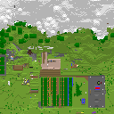

# Minecraft Map to PNG Converter

This Rust application transforms Minecraft map data from NBT format into a visual PNG image. Additionally, a WebAssembly module is available for converting images on the client side.



## Features

- Convert compressed Minecraft map NBT files to PNG images.
- Direct memory-based image processing suitable for web assembly integration.
- Efficient error handling and informative error messages.

## Demo Site

[Demo Site](https://masaishi.github.io/mc_map2png)

I provide a web interface that allows users to convert Minecraft NBT files to PNG images directly within their browser.

The website is built using HTML and Tailwind CSS for styling. It features a simple drag-and-drop interface for file upload, a convert button, and displays the resulting PNG image which can then be downloaded. The site runs entirely client-side, leveraging WebAssembly to perform image conversion.

## WebAssembly Usage

To use the WebAssembly module, include the following steps in your web application:

1. **Initialize the WASM Module**: First, ensure that the WASM module is loaded and initialized correctly. This is done by importing the initialization function and the specific functions you need from the generated WASM package.

    ```javascript
    import init, { process_image_from_memory } from './path_to_wasm_package/mc_map2png.js';

    await init();
    ```

2. **File Processing**: Convert user-uploaded files by reading them into an ArrayBuffer, then passing this buffer to the WASM function:

    ```javascript
    const fileInput = document.getElementById('fileInput');
    const file = fileInput.files[0];
    const arrayBuffer = await file.arrayBuffer();
    const result = await process_image_from_memory(new Uint8Array(arrayBuffer));
    ```

3. **Displaying the Image**: Upon successful conversion, display the image or handle errors appropriately:

    ```javascript
    if (result instanceof Uint8Array) {
        const blob = new Blob([result], {type: 'image/png'});
        const url = URL.createObjectURL(blob);
        document.getElementById('outputImage').src = url;
    } else {
        console.error('Conversion failed.');
    }
    ```

4. **Download Option**: Provide users with the option to download the generated PNG:

    ```javascript
    const downloadButton = document.getElementById('downloadButton');
    downloadButton.onclick = () => {
        const link = document.createElement('a');
        link.href = URL.createObjectURL(new Blob([result], {type: 'image/png'}));
        link.download = 'converted-image.png';
        link.click();
    };
    ```

## Installation

Clone the repository to your local machine:

```bash
git clone https://github.com/masaishi/mc_map2png.git
cd mc_map2png
```

Build the project using Cargo:

```bash
cargo build --release
```

## Usage

To convert an NBT file to a PNG image, run:

```bash
cargo run --release -- <input_path> <output_path>
```

Where:
- `<input_path>` is the path of Minecraft map NBT file. (e.g., `map_0.dat`)
- `<output_path>` is the desired path for the output PNG file. (e.g., `map_0.png`)

